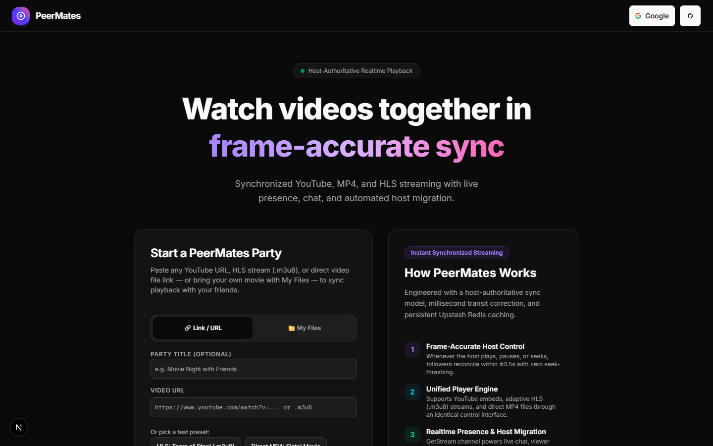
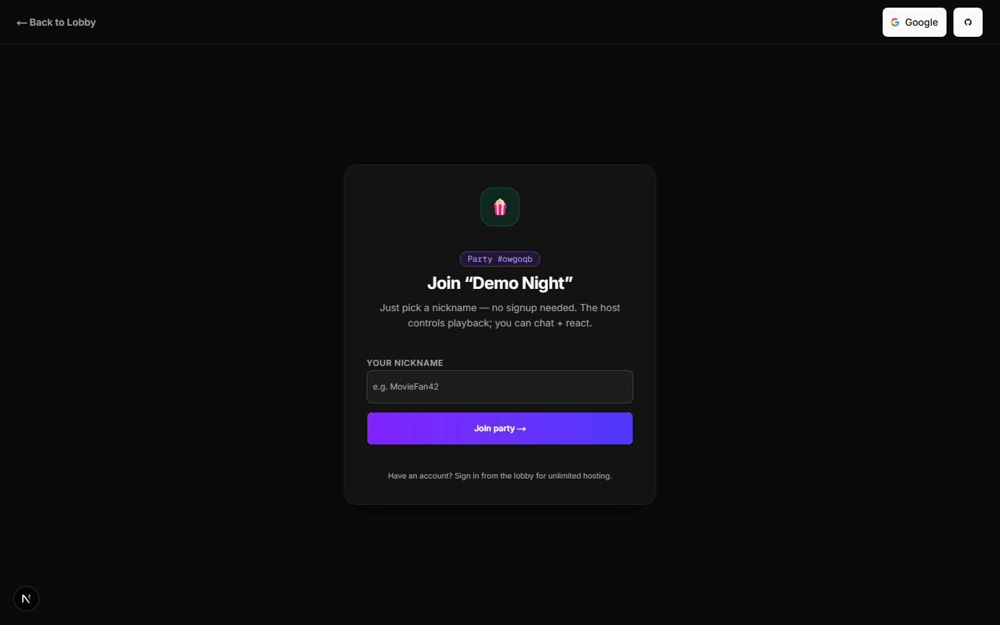
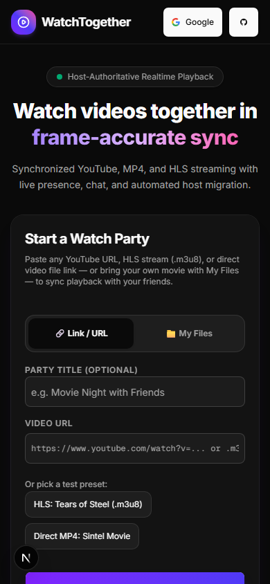
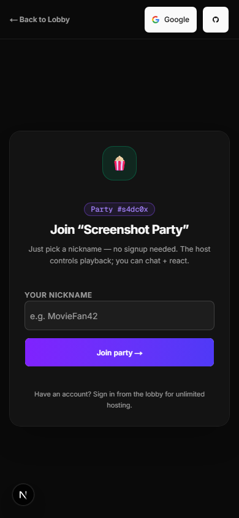

# PeerMates 🍿

Watch videos together in frame-accurate sync — YouTube, HLS, MP4, or your own
movie files — with live chat, voice notes, AI-translated subtitles, and
host-controlled playback for up to ~500 viewers per room.
   
## Screenshots

| Lobby (desktop) | Guest join (desktop) |
| --- | --- |
|  |  |

| Lobby (mobile, 390px) | Guest join (mobile, 390px) |
| --- | --- |
|  |  |

> Screenshots are static captures of the lobby (`/`) and the guest nickname
> gate (`/room/[code]`). To retake them, run the dev server, create a room via
> `POST /api/rooms`, and screenshot `/` plus `/room/<slug>` at 1440×900 and
> 390×844.

## Features

**Watch together**
- Host-authoritative sync: play, pause, and seeks reconcile within ±0.5s
  (gentle rate-nudge for small drift, one debounced seek for large drift)
- YouTube embeds, HLS (`.m3u8`), direct MP4/WebM, and "My Files" rooms where
  everyone plays their own local copy (only timestamps sync — bytes never upload)
- 3s host heartbeat + Redis playback snapshots, so late joiners land in sync
- Tap-to-play overlay for iPhone Safari autoplay blocks; fullscreen on iPhone
  (`webkitEnterFullscreen`) and Android/desktop (standard Fullscreen API)

**Rooms & sharing**
- Create a party from a link or your own file; join with a 6-letter code or
  pasted invite link (codes verified before navigating)
- Guest join with just a nickname — no signup; Google or GitHub sign-in for
  unlimited hosting
- Invite sheet: copy link, one-tap Share to WhatsApp, native share sheet, and
  a QR code for in-person sharing

**Chat**
- WhatsApp-style voice notes (tap to record, preview with speed control, send),
  photo/file attachments with on-device compression, replies, emoji reactions,
  typing indicators, slow mode, and viewer mute-all
- Message count tracks visible messages (deleted tombstones excluded)

**Subtitles + AI**
- Host/co-host uploads `.srt`/`.vtt` — synced for everyone via `<track>`
- Per-viewer language (AI-translated, cached forever by file-hash + language)
  and per-viewer caption size
- "Catch me up" recap of everything said so far (cached by file-hash + minute)
- Provider-agnostic `lib/ai.ts`: `AI_PROVIDER=gemini|openrouter|claude`
  (default Gemini Flash-Lite free tier; OpenRouter credit exhaustion falls back
  to Gemini automatically; quota errors keep original subtitles playing)

**Roles & moderation (server-enforced, never UI-only)**
- Host + host-appointed co-hosts: playback control, source changes, kicks,
  mutes, slow mode. Viewers: chat + react only
- Upstash role check on every control event plus GetStream channel role
  mirroring; automatic host migration when the host disconnects
- Upstash rate limits on state writes, chat, presence, reactions, room
  creation/joins, and all AI calls

**Mobile-first**
- 360px-first layout, 44px tap targets, safe-area insets, `dvh` units, no
  horizontal scroll; hidden-scroll chat with pinned input bar; PWA installable
  with an offline page; Data Saver + session data meter with regional pricing

## Tech stack

| Layer | Choice |
| --- | --- |
| App | Next.js 16 (App Router) + React 19 + Tailwind CSS 4 |
| Realtime | GetStream Chat (`livestream` channels; polling fallback) |
| State | Upstash Redis (presence, playback, roles, subtitles, rate limits) |
| DB | Neon Postgres + Drizzle ORM |
| Auth | better-auth (Google + GitHub OAuth) |
| AI | Gemini / OpenRouter / Claude via `lib/ai.ts` |
| Video | `hls.js`, YouTube IFrame API, native `<video>` |

## Getting started

```bash
npm install
npm run dev   # http://localhost:3000
```

Copy `.env.example` to `.env.local` and fill in:

| Variable | Where from |
| --- | --- |
| `DATABASE_URL` | Neon dashboard → connection string |
| `BETTER_AUTH_SECRET` | any random 32+ char string |
| `BETTER_AUTH_URL` | `http://localhost:3000` locally; prod URL on Vercel |
| `NEXT_PUBLIC_SITE_URL` | `https://peermates.vercel.app` — canonical URL for invite links, QR codes, shares |
| `GITHUB_CLIENT_ID` / `GITHUB_CLIENT_SECRET` | GitHub → Settings → Developer settings → OAuth Apps |
| `GOOGLE_CLIENT_ID` / `GOOGLE_CLIENT_SECRET` | Google Cloud Console → APIs & Services → Credentials |
| `STREAM_API_KEY` / `STREAM_API_SECRET` / `NEXT_PUBLIC_STREAM_API_KEY` | [getstream.io](https://getstream.io) dashboard |
| `UPSTASH_REDIS_REST_URL` / `UPSTASH_REDIS_REST_TOKEN` | [console.upstash.com](https://console.upstash.com) |
| `AI_PROVIDER` | `gemini` (default), `openrouter`, or `claude` |
| `GEMINI_API_KEY` (+ `GEMINI_MODEL`) | AI Studio (free tier; also the automatic fallback) |
| `OPENROUTER_API_KEY` (+ `OPENROUTER_MODEL`) | [openrouter.ai](https://openrouter.ai) keys page |
| `CLAUDE_API_KEY` (+ `CLAUDE_MODEL`) | Anthropic console (for later use) |

```bash
npm run build   # production check
npm start       # serve the production build
```

## Google OAuth setup

1. In Google Cloud Console, create an **OAuth 2.0 Client ID** (Web application).
2. Under **Authorized redirect URIs**, add one per environment:
   - `http://localhost:3000/api/auth/callback/google`
   - `https://<your-app>.vercel.app/api/auth/callback/google`
3. Paste the client ID/secret into `.env.local` (local) and Vercel
   Project → Settings → Environment Variables (production, then redeploy).
4. Production also needs `BETTER_AUTH_URL=https://<your-app>.vercel.app`,
   otherwise the OAuth callback returns to the wrong host.

## AI subtitles setup

- Set `AI_PROVIDER=openrouter` and paste `OPENROUTER_API_KEY` to translate
  with OpenRouter. If its credits/quota run out, calls automatically retry on
  the Gemini free tier (requires `GEMINI_API_KEY`).
- Set `AI_PROVIDER=claude` + `CLAUDE_API_KEY` to move to Claude later — no
  feature code changes needed.
- All AI keys are server-only (no `NEXT_PUBLIC_` prefix); the browser never
  sees them.

## Project structure

```
app/
  page.tsx                 Lobby: create party + join by code
  room/[slug]/page.tsx     Watch room (player, chat, panels)
  api/rooms/[slug]/…       state, presence, messages, roles, moderation,
                           subtitles, subtitles/translate, recap, …
components/
  player/                  Unified player (YouTube / HLS / MP4 / local file)
  chat/                    ChatPanel + WhatsApp-style VoiceRecorder
  room/                    Lobby, InviteSheet, NicknameGate, SubtitlesPanel, …
hooks/                     useWatchSync, useRoomSubtitles, useGuestIdentity, …
lib/
  ai.ts                    Provider-agnostic LLM module (server-only)
  redis/                   Upstash stores with in-memory dev fallback
  rooms/                   Roles, actor resolution, invite-code helpers
  subtitles/               SRT/VTT parse + serialize (shared client/server)
db/                        Drizzle schema + client (Neon)
public/screenshots/        README screenshots
```

## Deploy on Vercel

Import the repo in Vercel, add every variable from `.env.example` to the
project Environment Variables (including `BETTER_AUTH_URL` with the production
URL and the Google/GitHub OAuth credentials), then deploy. OAuth providers
need the production redirect URIs registered (see Google setup above; same
pattern for GitHub: `https://<your-app>.vercel.app/api/auth/callback/github`).
